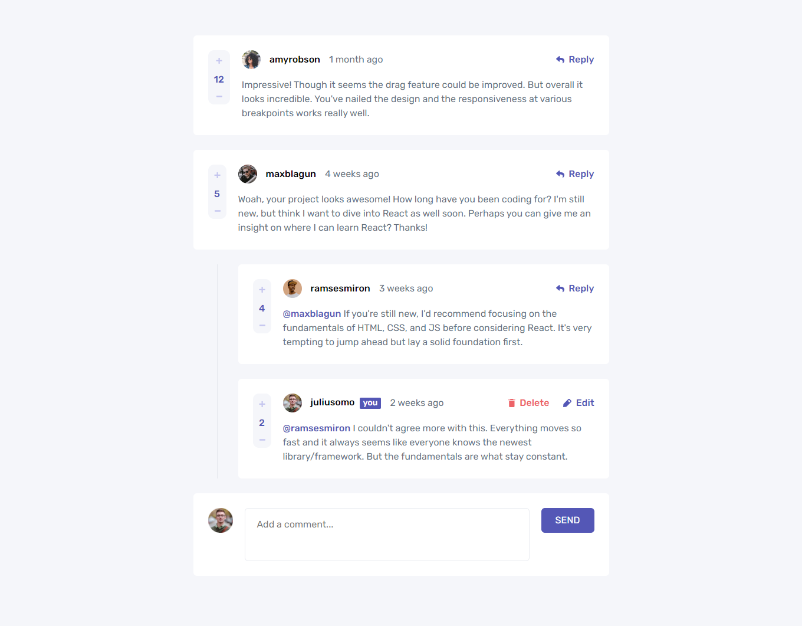
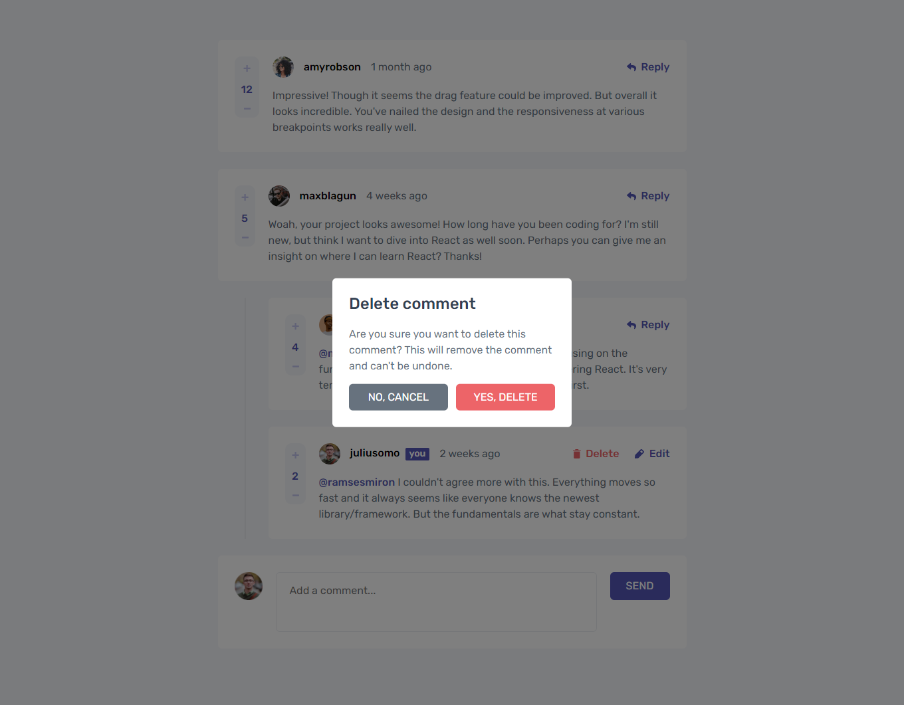
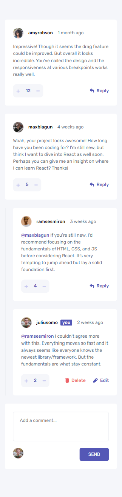
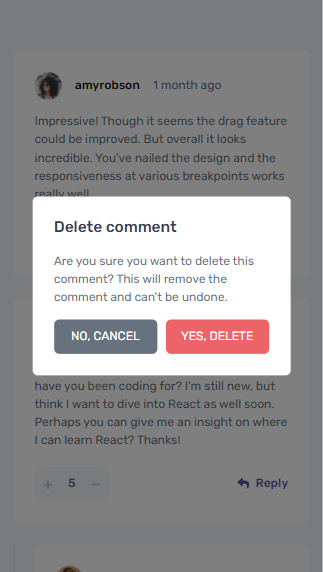

# Frontend Mentor - Interactive comments section solution

This is a solution to the [Interactive comments section challenge on Frontend Mentor](https://www.frontendmentor.io/challenges/interactive-comments-section-iG1RugEG9). Frontend Mentor challenges help you improve your coding skills by building realistic projects. 

## Table of contents

- [Overview](#overview)
  - [The challenge](#the-challenge)
  - [Screenshot](#screenshot)
  - [Links](#links)
- [My process](#my-process)
  - [Built with](#built-with)
  - [What I learned](#what-i-learned)
  - [Continued development](#continued-development)
  - [Useful resources](#useful-resources)
- [Author](#author)

## Overview

### The challenge

Users should be able to:

- View the optimal layout for the app depending on their device's screen size
- See hover states for all interactive elements on the page
- Create, Read, Update, and Delete comments and replies
- Upvote and downvote comments
- **Bonus**: If you're building a purely front-end project, use `localStorage` to save the current state in the browser that persists when the browser is refreshed.
- **Bonus**: Instead of using the `createdAt` strings from the `data.json` file, try using timestamps and dynamically track the time since the comment or reply was posted.

### Screenshot






### Links

- Solution URL: [Interactive Comments Section Frontend Mentor Solution](https://github.com/MohMostafa-Web/interactive-comments-section-frontend-mentor)
- Live Site URL: [Interactive Comments Section Live Site](https://mohmostafa-web.github.io/interactive-comments-section-frontend-mentor/)

## My process

### Built with

- Semantic HTML5 markup
- Sass custom properties [Varaibles, Mixins , Media Queries, Components]
- Flexbox
- Pure JS

### What I learned


```css
.proud-of-this-css {
  color: papayawhip;
}
```

- use Sass Preprocessor Mixins, see code below

```scss
/* Prefixer Mixin */
@mixin prefixer($property, $value, $prefixes:()) {
  #{$property} : $value;
  @each $prefix in $prefixes {
    #{"-" + $prefix + "-" + $property}: $value;
  }
}
```

- use fetch().then().then() to fetch data from JSON file "data.json", see code below:

```html
<script type="module" src="js/main.js"></script>
```
```js
// Create variable to save current user data
let currentUserObj;
await fetch("data.json")
  .then(res => res.json())
  .then(data => {
    // Get current user data and save it in currentUserObj
    currentUserObj = data["currentUser"];
  }
```

- use js to create elements and insert them to the DOM, as below example:

```js
// Create Main Section
const mainSection = document.createElement("section");
mainSection.className = "interactive-comments";

// Create Container 
const containerDiv = document.createElement("div");
containerDiv.className = "container";

// Create Comments div
const commentsDiv = document.createElement("div");
commentsDiv.className = "comments";
containerDiv.append(commentsDiv);

// Loop over comments array
for (let comment of data["comments"]) {
  // Create Comment
  const commentDiv = document.createElement("div");
  commentDiv.className = "comment";

  // Check if comment is not made by current user
  if (comment.user.username !== data["currentUser"].username) {
    commentDiv.innerHTML = createComment(comment);
  } else {
    commentDiv.innerHTML = createCommentByCurrentUser(comment, comment["replyingTo"], comment.content);
    commentDiv.classList.add("current-user");
  }
  commentsDiv.append(commentDiv);

  // Create replies div
  const repliesDiv = document.createElement("div");
  repliesDiv.className = "replies";
  commentsDiv.append(repliesDiv);

  // Check if there are replies for comment
    // Create replies of comment
  if (comment["replies"].length !== 0) {
    // Loop over replies array
    comment["replies"].forEach(reply => {
      // Create Reply
      const replyDiv = document.createElement("div");
      replyDiv.className = "comment";

      // Check if Reply is not made by current user
      if (reply.user.username !== data["currentUser"].username) {
        replyDiv.innerHTML = createComment(reply);
      } else {
        replyDiv.innerHTML = createCommentByCurrentUser(reply, reply["replyingTo"], reply.content);
        replyDiv.classList.add("current-user");
      }
      repliesDiv.append(replyDiv);
    });
  }
}
```

- use date methods: Date.now() & new Date ().getTime(), see below code:

```js
// Create function to calculte time units
function calcaluteTime(dateInString) {
  // Get milliSeconds from created date to now
  let diff = Date.now() - new Date(dateInString).getTime();
  
  let seconds = diff / 1000;
  let intSeconds = Math.round(seconds);
  
  let minutes = seconds / 60;
  let intMinutes = Math.round(minutes);
  
  let hours = minutes / 60;
  let intHours = Math.round(hours);
  
  let days = hours / 24;
  let intDays = Math.round(days);
  
  let weeks = days / 7;
  let intWeerks = Math.round(weeks);
  
  let months = days / 30;
  let intMonths = Math.round(months);
  
  let years = days / 365;
  let intYears = Math.round(years);
  
  if (intSeconds < 60) {
    return intSeconds > 1 ? `${intSeconds} seconds ago`: `${intSeconds} second ago`;
  } else if (intMinutes < 60) {
    return intMinutes > 1 ? `${intMinutes} minutes ago`: `${intMinutes} minute ago`;
  } else if (intHours < 24) {
    return intHours > 1 ? `${intHours} hours ago`: `${intHours} hour ago`;
  } else if (intDays < 7) {
    return intDays > 1 ? `${intDays} days ago`: `${intDays} day ago`;
  } else if (intDays < 30) {
    return intWeerks > 1 ? `${intWeerks} weeks ago`: `${intWeerks} weeks ago`;
  } else if (intDays < 365) {
    return intMonths > 1 ? `${intMonths} months ago`: `${intMonths} month ago`;
  } else {
    return intYears > 1 ? `${intYears} years ago`: `${intYears} year ago`;
  }
}
```

### Continued development

In the future, I will use more frameworks like bootstrap, jQuery, js plugins or react js

### Useful resources

- [youtube playlist (Create Web Design With Sass)](https://www.youtube.com/playlist?list=PLDoPjvoNmBAz9sluuyOWPifXvySgrGma8) - This is an amazing channel which helped me and this playlist helped me to understand Sass. I'd recommend it to anyone still learning this channel.

## Author

- Linkedin - [Mohamed Mostafa](https://www.linkedin.com/in/mohamed-mostafa-4a08aa1a2/)
- Frontend Mentor - [@MohMostafa-Web](https://www.frontendmentor.io/profile/MohMostafa-Web)
- Github - [@MohMostafa-Web](https://github.com/MohMostafa-Web)
